In the following set of figures, we visualize the activation distribution for each layer in the VGG-16 architecture. $x_p$ denotes the 99.99th percentile of activations, indicated by the rightmost red dashed line. The encoding range of TTFS, $[\frac{1}{64}x_p, x_p]$, corresponds to the region to the right of the leftmost red dashed line. For CSS, the encoding range is $[\frac{1}{8}x_p, x_p]$, i.e., the region to the right of the middle red dashed line.

We report the relative proportion of activation counts within the two different encoding ranges, along with the average number of spikes used by CSS to encode a single activation. As shown in the figures, **much fewer neurons are activated under CSS coding, and on average, it takes only around 1.5 spikes per activation**.

* ReLU 1:
    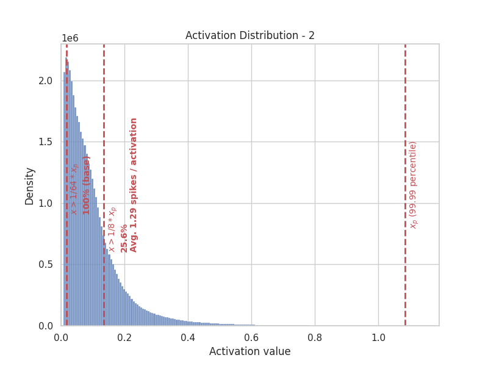
    
* ReLU 2:
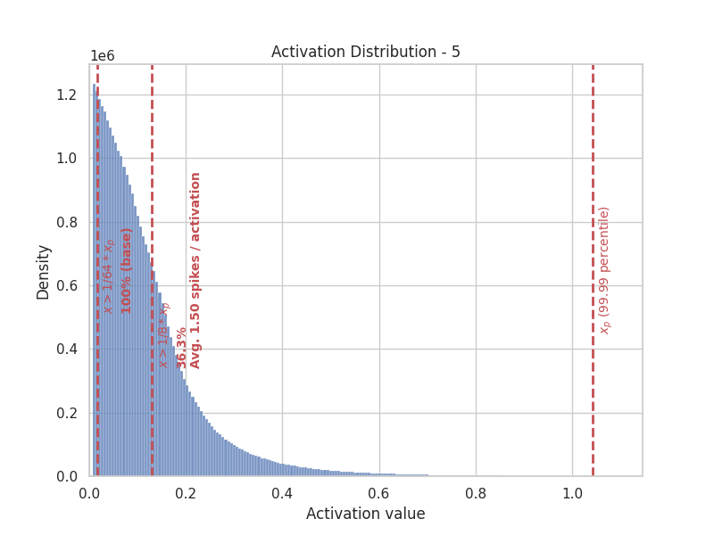

* ReLU 3:
    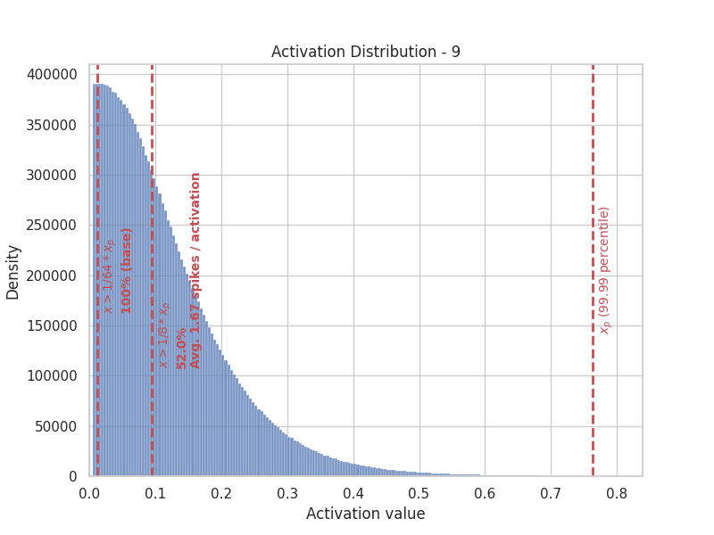

* ReLU 4:
    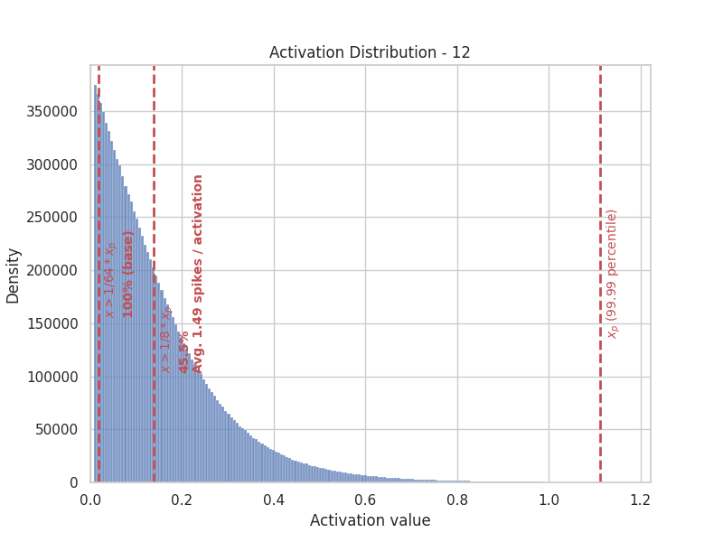

* ReLU 5:
    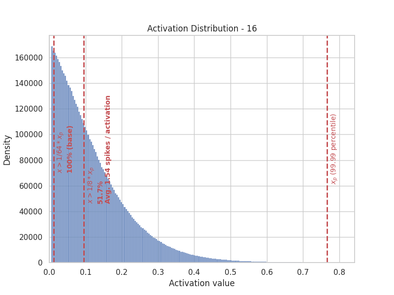

* ReLU 6:
    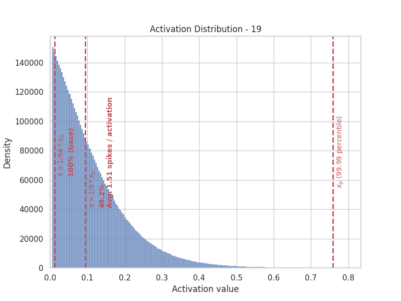

* ReLU 7:
    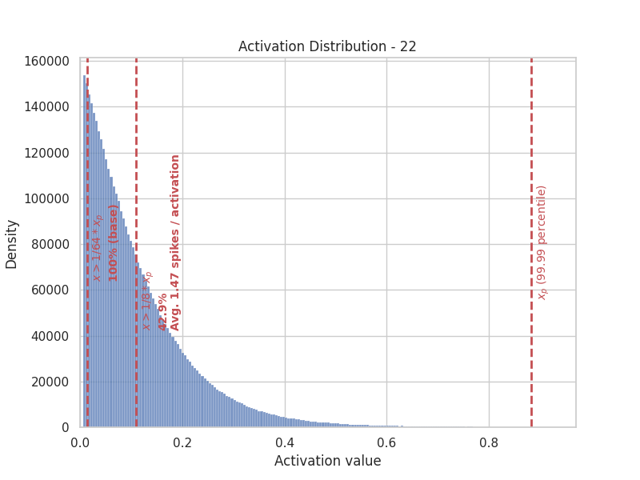

* ReLU 8:
    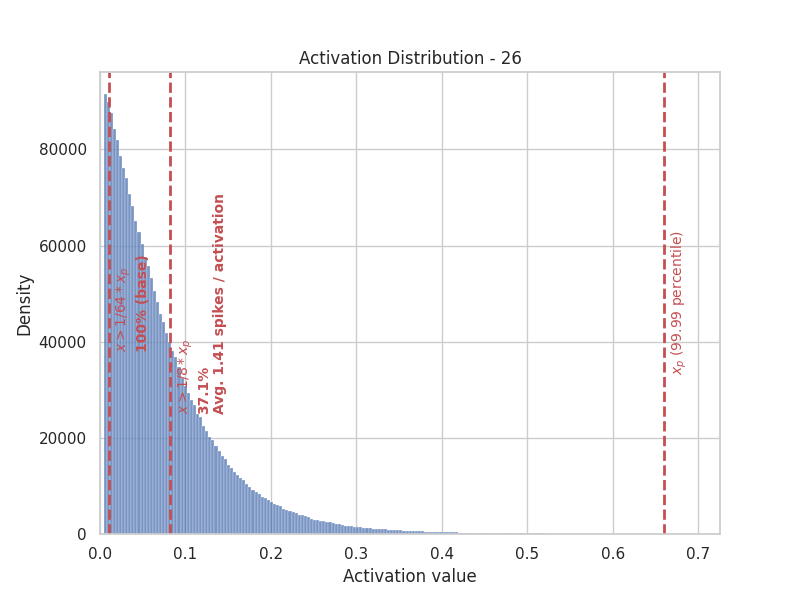

* ReLU 9:
    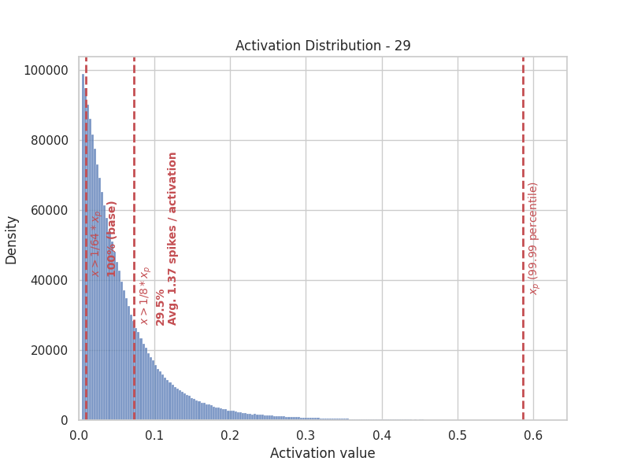

* ReLU 10:
    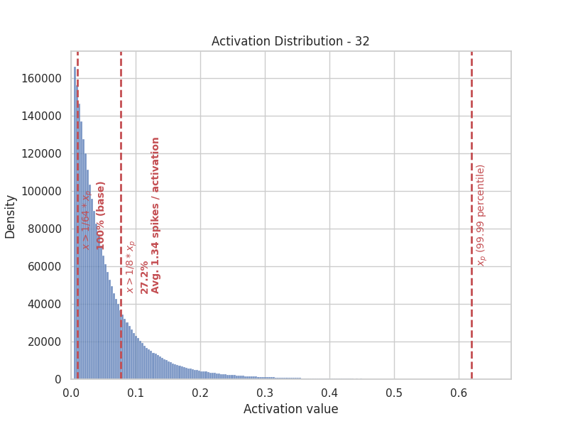

* ReLU 11:
    

* ReLU 12:
    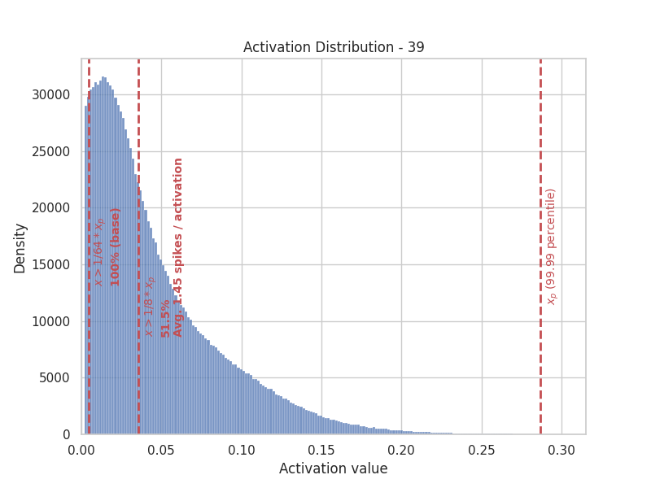

* ReLU 13:
    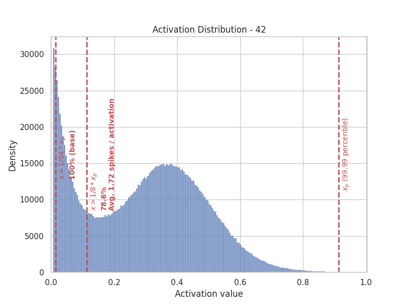